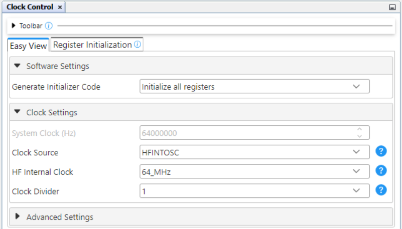
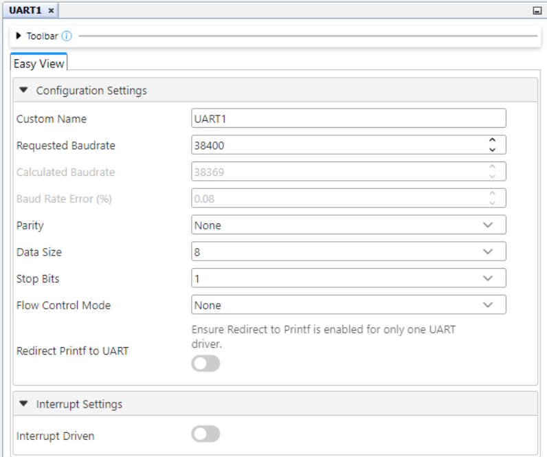
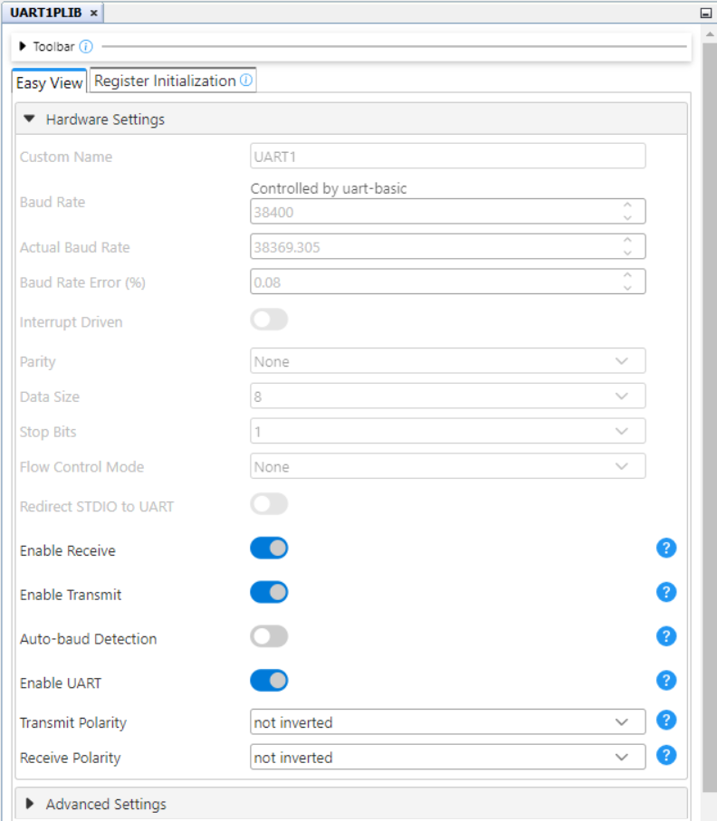
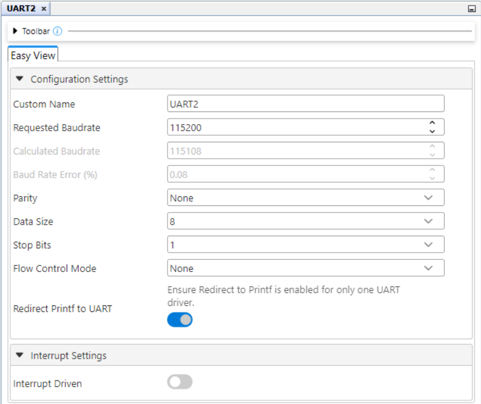
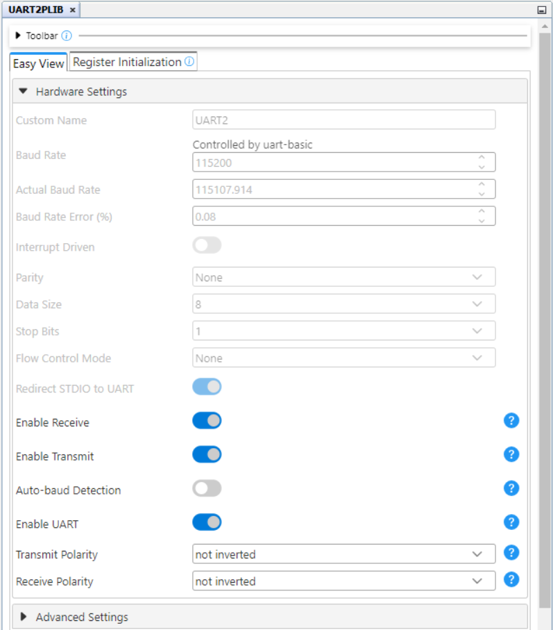
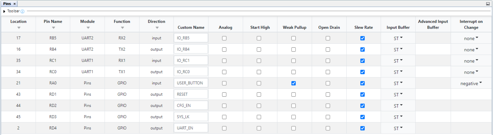
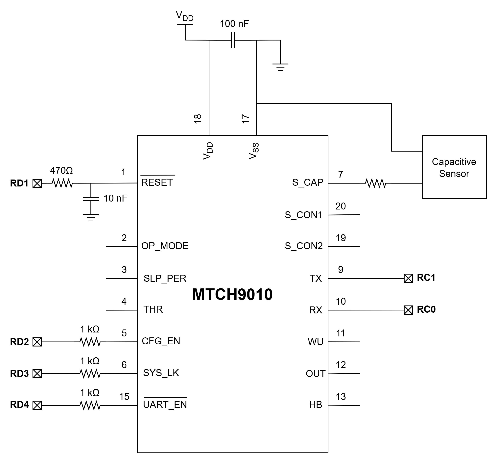
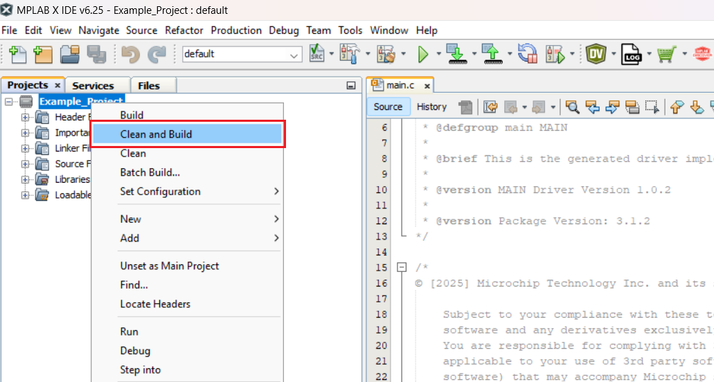

<!-- Please do not change this html logo with link -->

# MTCH9010 Dynamic Enhanced Configuration Change Using the PIC18F56Q71 Microcontroller with MCC Melody

This MPLAB® X project shows how to dynamically change the configuration for MTCH9010 using the Enhanged Configuration Mode. The PIC18F56Q71 microcontroller is used as a host device and the configuration is realiased using the Universal Asynchronous Receiver Transmitter (UART) peripheral.

## Related Documentation
- [MTCH9010 Product Page](https://www.microchip.com/en-us/product/MTCH9010?utm_source=GitHub&utm_medium=TextLink&utm_campaign=MCU8_PIC18-Q71&utm_content=pic18f56q71-mtch9010-dynamic-cfg-change-github&utm_bu=MCU08)
- [PIC18F56Q71 Product Page](https://www.microchip.com/en-us/product/PIC18F56Q71?utm_source=GitHub&utm_medium=TextLink&utm_campaign=MCU8_PIC18-Q71&utm_content=pic18f56q71-mtch9010-dynamic-cfg-change-github&utm_bu=MCU08)
- [PIC18F56Q71 Code Examples on Discover](https://mplab-discover.microchip.com/v2?dsl=PIC18F56Q71)
- [PIC18F56Q71 Code Examples on GitHub](https://github.com/microchip-pic-avr-examples/?q=PIC18F56Q71)

## Software Used
- [MPLAB X IDE v6.25 or newer](https://www.microchip.com/en-us/tools-resources/develop/mplab-x-ide?utm_source=GitHub&utm_medium=TextLink&utm_campaign=MCU8_PIC18-Q71&utm_content=pic18f56q71-mtch9010-dynamic-cfg-change-github&utm_bu=MCU08)
- [MPLAB® XC8 v3.0 or newer](https://www.microchip.com/en-us/tools-resources/develop/mplab-xc-compilers?utm_source=GitHub&utm_medium=TextLink&utm_campaign=MCU8_PIC18-Q71&utm_content=pic18f56q71-mtch9010-dynamic-cfg-change-github&utm_bu=MCU08)
- [PIC18F-Q_DFP 1.28.451](https://packs.download.microchip.com/)

## Hardware Used

- The [PIC18F56Q71 Curiosity Nano Development board](https://www.microchip.com/en-us/development-tool/EV01G21A?utm_source=GitHub&utm_medium=TextLink&utm_campaign=MCU8_PIC18-Q71&utm_content=pic18f56q71-mtch9010-dynamic-cfg-change-github&utm_bu=MCU08) is used as a test platform:
     
- [MTCH9010](https://www.microchip.com/en-us/product/MTCH9010?utm_source=GitHub&utm_medium=TextLink&utm_campaign=MCU8_PIC18-Q71&utm_content=pic18f56q71-mtch9010-dynamic-cfg-change-github&utm_bu=MCU08)
     

## Operation

To program the Curiosity Nano board with this MPLAB X project, follow the steps provided in the [How to Program the Curiosity Nano Board](#how-to-program-the-curiosity-nano-board) section.

## Concept

In Enhanced Configuration Mode, the MTCH9010 device can be configured using the UART communication protocol. To enter in this configuration mode, the following settings should be done on the MTCH9010 configuration pins:
- SYS_LK pin should be set high (disabled)
- CFG_EN pin should be set low (enabled)
- UART_EN pin should be set low (enabled)

A reset of the device is needed after the pins are configured to enter the configuration mode. This can be done using the RESET pin by making it low for a time period (10 ms are used in this example) and then restore it to high.

After the reset operation, the device will send on serial port the firmware version and then will wait for the configuration commands. Each command that is send should be followed be a validation key (with the ASCII code equal to 0x0D in hexadecimal system). After a command is sent, the device will respond with ACK (0x06 in hexadecimal system) or NAK (0x15 in hexadecimal system) followed by the validation key. If a NAK signal is received, the command should be send again until it is validated by the device with an ACK signal.

In this code example, the `MTCH9010.h` and `MTCH9010.c` files contains the implementation of the functions used to configure the device in Enhanced Configuration Mode. The `mtch9010_config_t` structure is used to simply define the parameters of the configuration that need to be sent.  The `MTCH9010_Config(mtch9010_config_t configData)` function can be used to configure the device. This function sets the pins for configuration mode, reset the device and then send the configuration parameters using the UART1 peripheral. The function also implements a mechanism that verifies if each command is validated by the ACK signal. If it is validated, the program continue with the next command the same way. If it is not validated, the program repeats the transmission. Each command is repeated for a maximum number of five times. After that the function returns an error code and the program blocks in an infinite loop. A message about the error code is also displayed on serial port using the UART2 peripheral.

This example contains two configurations of the MTCH9010. User can switch between configurations using the on-board button of the PIC18F56Q71 Curiosity Nano. The parameters of the two configuration are shown below:
- Configuration 1:
    - SYS LOCK: ON
	- CFG Mode: OFF
    - Sleep time: 2s
    - Operation mode: Capacitive
	- Extended output mode: Enabled
    - Extended output format: Standard
    - Reference value: Standard
	- Threshold: 300

- Configuration 2:
    - SYS LOCK: ON
	- CFG Mode: OFF
    - Sleep time: 4s
    - Operation mode: Capacitive
	- Extended output mode: Disabled
    - Reference value: Standard
	- Threshold: 2000

## Setup

The following peripheral and clock configurations are set up using the MPLAB Code Configurator (MCC) Melody for the PIC18F56Q71:

1. Clock Control
    - Clock Source: HFINTOSC
    - HF Internal Clock: 64_MHz
    - Clock Divider: 1
     

2. UART1
    - Requested Baudrate: 38400
    - Parity: None
    - Data Size: 8
    - Stop Bits: 1
     

3. UART1PLIB
    - Enable Receive: Enabled
    - Enable Transmit: Enabled
    - Enable UART: Enabled
     

4. UART2
    - Requested Baudrate: 115200
    - Parity: None
    - Data Size: 8
    - Stop Bits: 1
    - Redirect Printf to UART: Enabled
     

5. UART2PLIB
    - Enable Receive: Enabled
    - Enable Transmit: Enabled
    - Enable UART: Enabled
     

6. Pin Grid View
     

7. Pins
      

The following pins are used to control the MTCH9010:

| Pin | Configuration  |          Description         | Custom name |
| :-: | :------------: | :--------------------------: |:-----------:|
| RA0 | Digital input  |     Button input pin         | USER_BUTTON |
| RC0 | Digital output |     UART1 Tx (MTCH9010 Rx)   |      -      |
| RC1 | Digital input  |     UART1 Rx (MTCH9010 Tx)   |      -      |
| RD1 | Digital output |     MTCH9010 RESET pin       |    RESET    |
| RD2 | Digital output |     MTCH9010 CFG_EN pin      |    CFG_EN   |
| RD3 | Digital output |     MTCH9010 SYS_LK pin      |    SYS_LK   |
| RD4 | Digital output |     MTCH9010 UART_EN pin     |   UART_EN   |

## Demo

The following diagram shows the connection realised between the PIC18F56Q71 microcontroller and the MTCH9010 for the configurations presented in this example. The MTCH9010 is powered from a 3.3 V power supply.
 

## Summary

This project shows how to dynamically change the configuration of the MTCH9010 in Enhanged Configuration Mode using the PIC18F56Q71 microcontroller as a host device.

##  How to Program the Curiosity Nano Board 

This chapter demonstrates how to use the MPLAB X IDE to program a PIC® device with an Example_Project.X. This is applicable to other projects.

1.  Connect the board to the PC.

2.  Open the Example_Project.X project in MPLAB X IDE.

3.  Set the Example_Project.X project as main project.
     Right click the project in the **Projects** tab and click **Set as Main Project**.
     

4.  Clean and build the Example_Project.X project.
     Right click the **Example_Project.X** project and select **Clean and Build**.
     

5.  Select **PICxxxxx Curiosity Nano** in the Connected Hardware Tool section of the project settings:
     Right click the project and click **Properties**.
     Click the arrow under the Connected Hardware Tool.
     Select **PICxxxxx Curiosity Nano** (click the **SN**), click **Apply** and then click **OK**:
     

6.  Program the project to the board.
     Right click the project and click **Make and Program Device**.
     

 

- - - 
## Menu
- [Back to Top](#mtch9010-dynamic-enhanced-configuration-change-using-the-pic18f56q71-microcontroller-with-mcc-melody)
- [Back to Related Documentation](#related-documentation)
- [Back to Software Used](#software-used)
- [Back to Hardware Used](#hardware-used)
- [Back to Operation](#operation)
- [Back to Concept](#concept)
- [Back to Setup](#setup)
- [Back to Demo](#demo)
- [Back to Summary](#summary)
- [Back to How to Program the Curiosity Nano Board](#how-to-program-the-curiosity-nano-board)