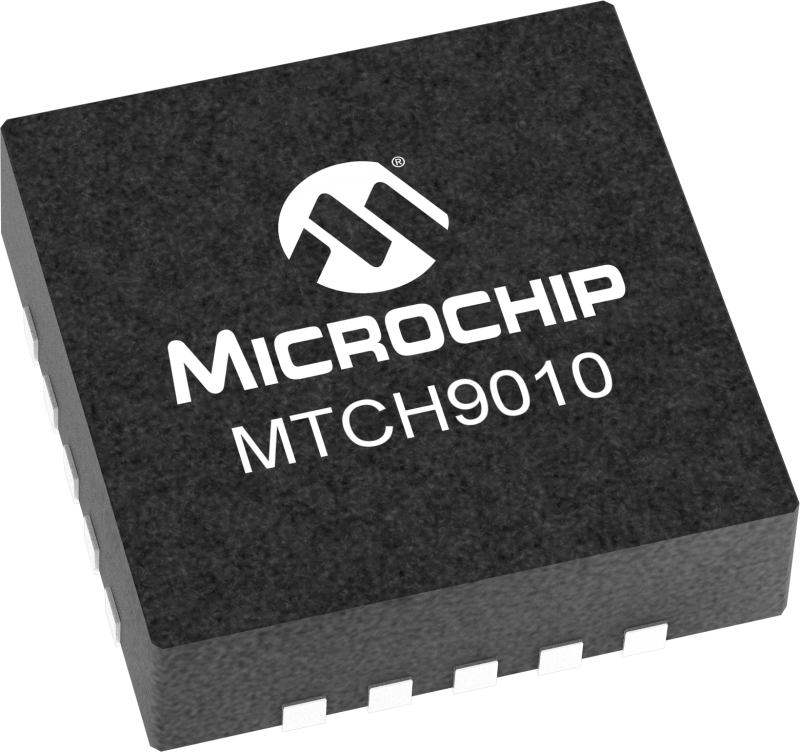
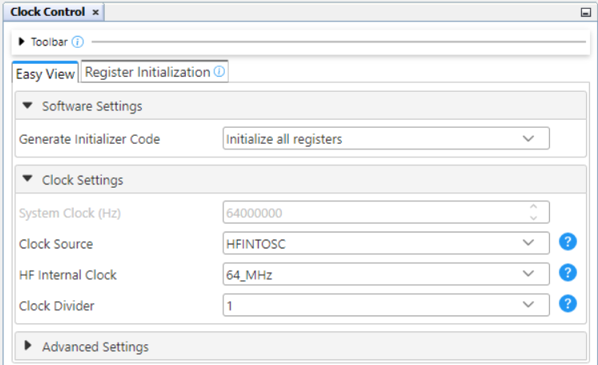
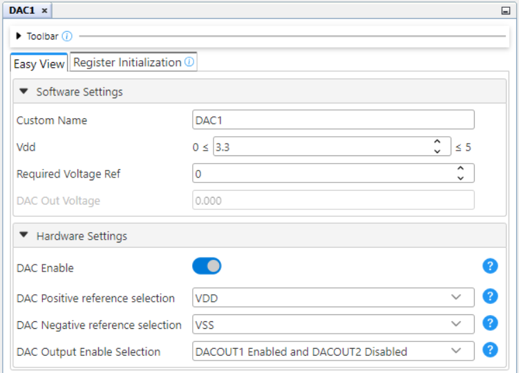
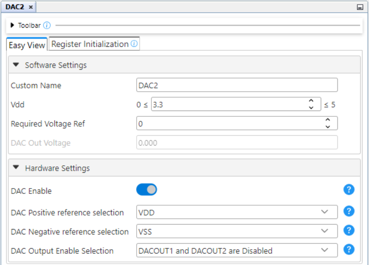
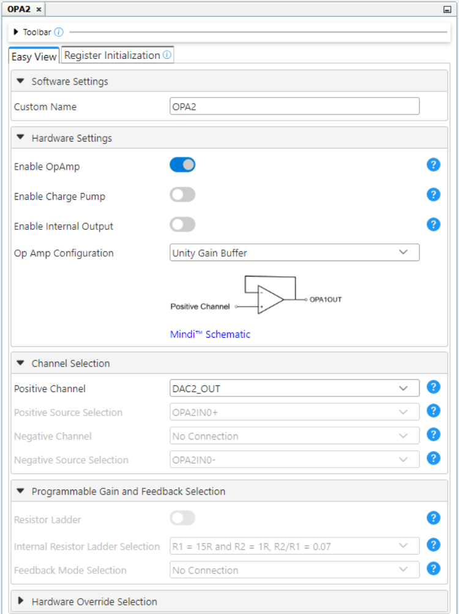
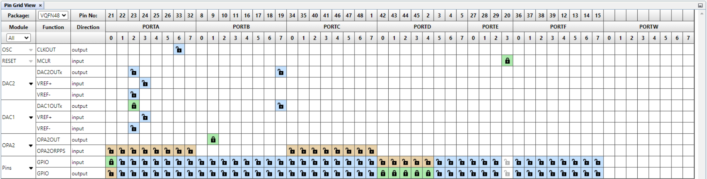
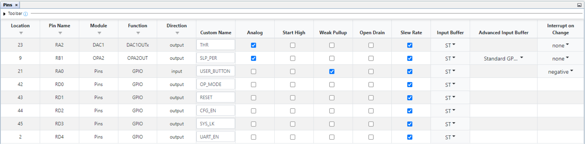
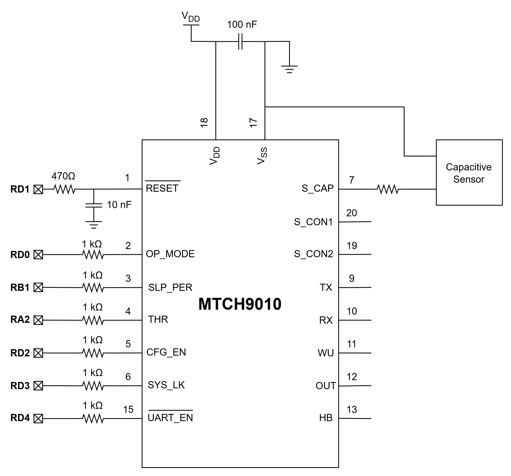
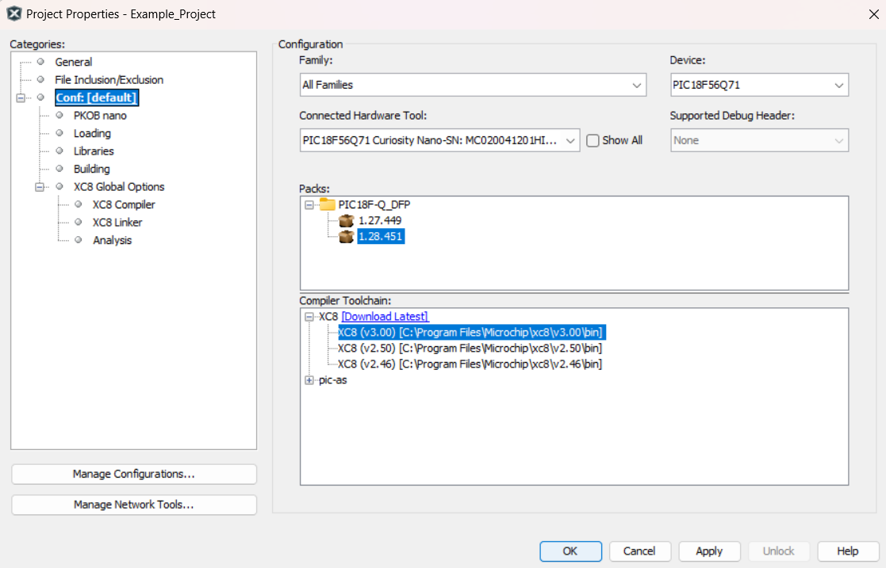
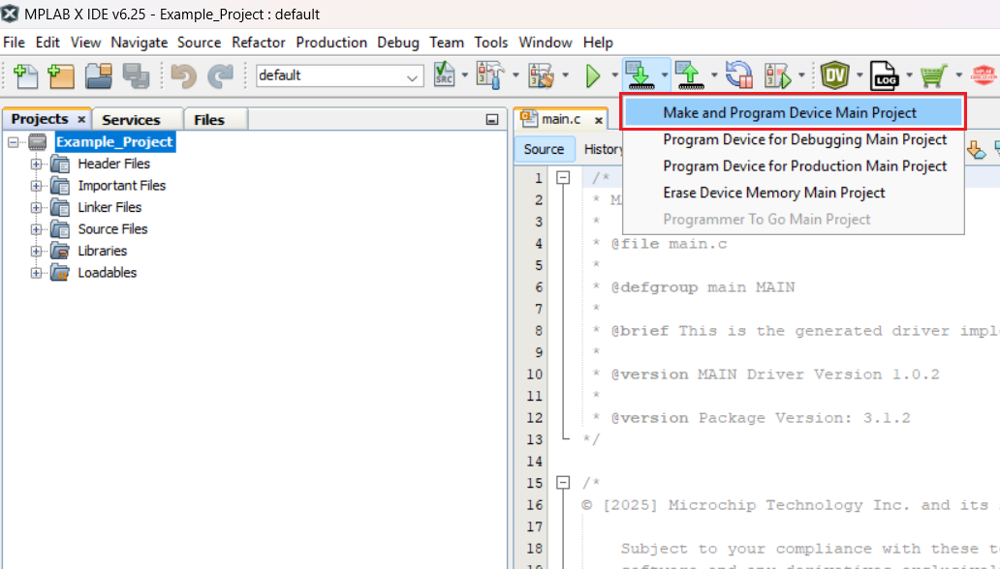

<!-- Please do not change this html logo with link -->

# MTCH9010 Dynamic Input Pins Configuration Change Using the PIC18F56Q71 Microcontroller with MCC Melody

This MPLAB® X project shows how to dynamically change the configuration for MTCH9010 using the configuration input pins. The PIC18F56Q71 microcontroller is used as a host device and the configuration is realised using the Digital-to-Analog Converter (DAC) and Operational Amplifier (OPA) peripherals.

## Related Documentation
- [MTCH9010 Product Page](https://www.microchip.com/en-us/product/MTCH9010?utm_source=GitHub&utm_medium=TextLink&utm_campaign=MCU8_PIC18-Q71&utm_content=pic18f56q71-mtch9010-dynamic-cfg-change-github&utm_bu=MCU08)
- [PIC18F56Q71 Product Page](https://www.microchip.com/en-us/product/PIC18F56Q71?utm_source=GitHub&utm_medium=TextLink&utm_campaign=MCU8_PIC18-Q71&utm_content=pic18f56q71-mtch9010-dynamic-cfg-change-github&utm_bu=MCU08)
- [PIC18F56Q71 Code Examples on Discover](https://mplab-discover.microchip.com/v2?dsl=PIC18F56Q71)
- [PIC18F56Q71 Code Examples on GitHub](https://github.com/microchip-pic-avr-examples/?q=PIC18F56Q71)

## Software Used
- [MPLAB X IDE v6.25 or newer](https://www.microchip.com/en-us/tools-resources/develop/mplab-x-ide?utm_source=GitHub&utm_medium=TextLink&utm_campaign=MCU8_PIC18-Q71&utm_content=pic18f56q71-mtch9010-dynamic-cfg-change-github&utm_bu=MCU08)
- [MPLAB® XC8 v3.00 or newer](https://www.microchip.com/en-us/tools-resources/develop/mplab-xc-compilers?utm_source=GitHub&utm_medium=TextLink&utm_campaign=MCU8_PIC18-Q71&utm_content=pic18f56q71-mtch9010-dynamic-cfg-change-github&utm_bu=MCU08)
- [PIC18F-Q_DFP 1.28.451 or newer](https://packs.download.microchip.com/)

## Hardware Used

- The [PIC18F56Q71 Curiosity Nano Development board](https://www.microchip.com/en-us/development-tool/EV01G21A?utm_source=GitHub&utm_medium=TextLink&utm_campaign=MCU8_PIC18-Q71&utm_content=pic18f56q71-mtch9010-dynamic-cfg-change-github&utm_bu=MCU08) is used as a test platform:
     
- [MTCH9010](https://www.microchip.com/en-us/product/MTCH9010?utm_source=GitHub&utm_medium=TextLink&utm_campaign=MCU8_PIC18-Q71&utm_content=pic18f56q71-mtch9010-dynamic-cfg-change-github&utm_bu=MCU08)
     

## Operation

To program the Curiosity Nano board with this MPLAB X project, follow the steps provided in the [How to Program the Curiosity Nano Board](#how-to-program-the-curiosity-nano-board) section.

## Concept

MTCH9010 can be configured using the configuration input pins. These input pins are read when the device is started, meaning that, for changing the configuration, these pins should be configured accordingly with the desired parameters and then a Reset operation should be done to configure the device with the new parameters. To use this configuration mode, the System Lock pin should be set high (disabled).

The Operation Mode, Extended Output, Enhanced Configuration mode and System Lock inputs are
set by connecting the pin to VDD or to GND. The Sleep Period and Liquid Detection Threshold inputs are set by applying a voltage level to the respective configuration pin. These voltages are generated using the DAC1 and DAC2 peripherals. The PIC18F56Q71 microcontroller can use only one output pin for all the DAC peripherals meaning that is not possible to generated the desired voltage for Threshold and Sleep on two output pins using only the DAC peripherals. The solution implemented uses the DAC1 peripheral for Threshold voltage and its output is directly connected on the `RA2` pin. For the Sleep time voltage, the DAC2 peripheral is used to generate the desired voltage as the internal positive input for the OPA2 peripheral. The OPA2 is used in Unity Gain Buffer mode and the output is connected to the `RB1` pin.

In this code example, the `MTCH9010.h` and `MTCH9010.c` files contain the implementation of the functions used to set the parameters of the desired configuration. The mtch9010_config_t structure is used to simply define these parameters. The MTCH9010_Config(mtch9010_config_t configData) function can be used to configure the device: this function sets the pins and the output voltage for DAC1 and DAC2 and resets the device to change its configuration.`

This example contains two configurations of the MTCH9010. The user can switch between configurations using the on-board button of the PIC18F56Q71 Curiosity Nano. An Interrupt-on-Change (IOC) is generated on the negative edge of the button input. After the interrupt occurs, a debouncing mechanism is implemented using a software delay. The state of the button is verified in the main loop after a 10 ms delay to determine if the pressed state is maintained. The parameters of the two configurations are shown below:
- Configuration 1:
    - SYS_LK: Disabled
	- CFG_EN: Disabled
    - Sleep Period: 2s
    - Operation Mode: Capacitive
	- Extended Output Mode: Disabled
	- Liquid Detection Threshold: 0.25V

- Configuration 2:
    - SYS_LK: Disabled
	- CFG_EN: Disabled
    - Sleep Period: 4s
    - Operation Mode: Capacitive
	- Extended Output Mode: Disabled
	- Liquid Detection Threshold: 1.3V

## Setup

The following peripheral and clock configurations are set up using the MPLAB Code Configurator (MCC) Melody for the PIC18F56Q71:

1. Clock Control
    - Clock Source: HFINTOSC
    - HF Internal Clock: 64_MHz
    - Clock Divider: 1
     

2. DAC1
    - Vdd: 3.3
    - Required Voltage Ref: 0
    - DAC Enable: Enabled
    - DAC Positive reference selection: VDD
    - DAC Negative reference selection: VSS
    - DAC Output Enable Selection: DACOUT1 Enabled and DACOUT2 Disabled
     

3. DAC2
    - Vdd: 3.3
    - Required Voltage Ref: 0
    - DAC Enable: Enabled
    - DAC Positive reference selection: VDD
    - DAC Negative reference selection: VSS
    - DAC Output Enable Selection: DACOUT1 and DACOUT2 are Disabled
     

4. OPA2
    - Enable OpAmp: Enabled
    - Op Amp Configuration: Unity Gain Buffer
    - Positive Channel: DAC2_OUT
     

5. Pin Grid View
     

6. Pins
     

The following pins are used to control MTCH9010:

| Pin | Configuration  |          Description         | Custom name |
| :-: | :------------: | :--------------------------: |:-----------:|
| RA0 | Digital input  |      Button input pin        | USER_BUTTON |
| RA2 | Analog output  |  MTCH9010 THR (DAC1OUT)      |     THR     |
| RB1 | Analog output  |  MTCH9010 SLP_PER (OPA2OUT)  |   SLP_PER   |
| RD0 | Digital output |     MTCH9010 OP_MODE pin     |   OP_MODE   |
| RD1 | Digital output |     MTCH9010 RESET pin       |    RESET    |
| RD2 | Digital output |     MTCH9010 CFG_EN pin      |    CFG_EN   |
| RD3 | Digital output |     MTCH9010 SYS_LK pin      |    SYS_LK   |
| RD4 | Digital output |     MTCH9010 UART_EN pin     |   UART_EN   |

## Demo

The following diagram shows the connection between the PIC18F56Q71 microcontroller and MTCH9010 for the configurations presented in this example. MTCH9010 is powered by a 3.3V power supply.
 

## Summary

This project shows how to dynamically change the configuration of MTCH9010 with the configuration input pins using the PIC18F56Q71 microcontroller as a host device.

##  How to Program the Curiosity Nano Board 

This chapter demonstrates how to use the MPLAB X IDE to program a PIC® device with an Example_Project.X. This is applicable to other projects, too.

1.  Connect the board to the PC.

2.  Open the `Example_Project.X` project in MPLAB X IDE.

3.  Set the `Example_Project.X` project as main project.
     Right click the project in the **Projects** tab and click **Set as Main Project**.
     

4.  Clean and build the `Example_Project.X` project.
     Right click the `Example_Project.X` project and select **Clean and Build**.
     

5.  Select **PICxxxxx Curiosity Nano** in the Connected Hardware Tool section of the project settings:
     Right click the project and click **Properties**.
     Click the arrow under the Connected Hardware Tool.
     Select **PICxxxxx Curiosity Nano** (click **SN**), click **Apply** and then click **OK**:
     

6.  Program the project to the board.
     Right click the project and click **Make and Program Device**.
     

 

- - - 
## Menu
- [Back to Top](#mtch9010-dynamic-input-pins-configuration-change-using-the-pic18f56q71-microcontroller-with-mcc-melody)
- [Back to Related Documentation](#related-documentation)
- [Back to Software Used](#software-used)
- [Back to Hardware Used](#hardware-used)
- [Back to Operation](#operation)
- [Back to Concept](#concept)
- [Back to Setup](#setup)
- [Back to Demo](#demo)
- [Back to Summary](#summary)
- [Back to How to Program the Curiosity Nano Board](#how-to-program-the-curiosity-nano-board)