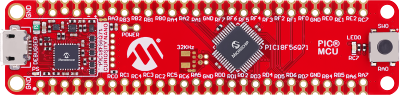

<!-- Please do not change this html logo with link -->

# MTCH9010 Dynamic Configuration Change Using the PIC18F56Q71 Microcontroller with MCC Melody

This repository provides two MPLAB® X projects that show how to dynamically change the configuration for MTCH9010 using the Enhanced Configuration Mode or the configuration input pins. The PIC18F56Q71 microcontroller is used as a host device to set the configuration parameters.

## Related Documentation
- [MTCH9010 Product Page](https://www.microchip.com/en-us/product/MTCH9010?utm_source=GitHub&utm_medium=TextLink&utm_campaign=MCU8_PIC18-Q71&utm_content=pic18f56q71-mtch9010-dynamic-cfg-change-github&utm_bu=MCU08)
- [PIC18F56Q71 Product Page](https://www.microchip.com/en-us/product/PIC18F56Q71?utm_source=GitHub&utm_medium=TextLink&utm_campaign=MCU8_PIC18-Q71&utm_content=pic18f56q71-mtch9010-dynamic-cfg-change-github&utm_bu=MCU08)
- [PIC18F56Q71 Code Examples on Discover](https://mplab-discover.microchip.com/v2?dsl=PIC18F56Q71)
- [PIC18F56Q71 Code Examples on GitHub](https://github.com/microchip-pic-avr-examples/?q=PIC18F56Q71)

## Software Used
- [MPLAB X IDE v6.25 or newer](https://www.microchip.com/en-us/tools-resources/develop/mplab-x-ide?utm_source=GitHub&utm_medium=TextLink&utm_campaign=MCU8_PIC18-Q71&utm_content=pic18f56q71-mtch9010-dynamic-cfg-change-github&utm_bu=MCU08)
- [MPLAB® XC8 v3.00 or newer](https://www.microchip.com/en-us/tools-resources/develop/mplab-xc-compilers?utm_source=GitHub&utm_medium=TextLink&utm_campaign=MCU8_PIC18-Q71&utm_content=pic18f56q71-mtch9010-dynamic-cfg-change-github&utm_bu=MCU08)
- [PIC18F-Q_DFP 1.28.451 or newer](https://packs.download.microchip.com/)

## Hardware Used

- The [PIC18F56Q71 Curiosity Nano Development board](https://www.microchip.com/en-us/development-tool/EV01G21A?utm_source=GitHub&utm_medium=TextLink&utm_campaign=MCU8_PIC18-Q71&utm_content=pic18f56q71-mtch9010-dynamic-cfg-change-github&utm_bu=MCU08) is used as a test platform:
     
- [MTCH9010](https://www.microchip.com/en-us/product/MTCH9010?utm_source=GitHub&utm_medium=TextLink&utm_campaign=MCU8_PIC18-Q71&utm_content=pic18f56q71-mtch9010-dynamic-cfg-change-github&utm_bu=MCU08)
     

## Operation

To program the Curiosity Nano board with this MPLAB X project, follow the steps provided in the [How to Program the Curiosity Nano Board](#how-to-program-the-curiosity-nano-board) section.

## Concept

The two projects are separated in the following folders:
  - [<strong>Enhanced_Configuration_Mode</strong>](Enhanced_Configuration_Mode) - this folder contains the project that configures the device in Enchanged Configuration Mode
  - [<strong>Input_Pins_Configuration_Mode</strong>](Input_Pins_Configuration_Mode) - this folder contains the project that configures the device using the configuration input pins

## Summary

These projects show how to dynamically change the configuration of the MTCH9010 in Enhanced Configuration Mode or with the configuration input pins using the PIC18F56Q71 microcontroller as a host device.

##  How to Program the Curiosity Nano Board 

This chapter demonstrates how to use the MPLAB X IDE to program a PIC® device with an Example_Project.X. This is applicable to other projects.

1.  Connect the board to the PC.

2.  Open the `Example_Project.X` project in MPLAB X IDE.

3.  Set the `Example_Project.X` project as main project.
     Right click the project in the **Projects** tab and click **Set as Main Project**.
     

4.  Clean and build the `Example_Project.X` project.
     Right click the `Example_Project.X` project and select **Clean and Build**.
     

5.  Select **PICxxxxx Curiosity Nano** in the Connected Hardware Tool section of the project settings:
     Right click the project and click **Properties**.
     Click the arrow under the Connected Hardware Tool.
     Select **PICxxxxx Curiosity Nano** (click the **SN**), click **Apply** and then click **OK**:
     

6.  Program the project to the board.
     Right click the project and click **Make and Program Device**.
     

 

- - - 
## Menu
- [Back to Top](#mtch9010-dynamic-configuration-change-using-the-pic18f56q71-microcontroller-with-mcc-melody)
- [Back to Related Documentation](#related-documentation)
- [Back to Software Used](#software-used)
- [Back to Hardware Used](#hardware-used)
- [Back to Operation](#operation)
- [Back to Concept](#concept)
- [Back to Summary](#summary)
- [Back to How to Program the Curiosity Nano Board](#how-to-program-the-curiosity-nano-board)